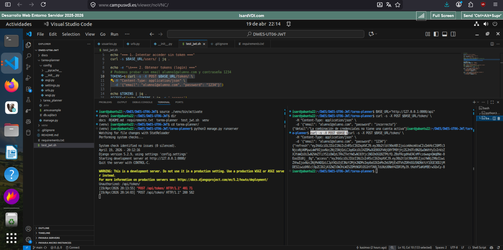
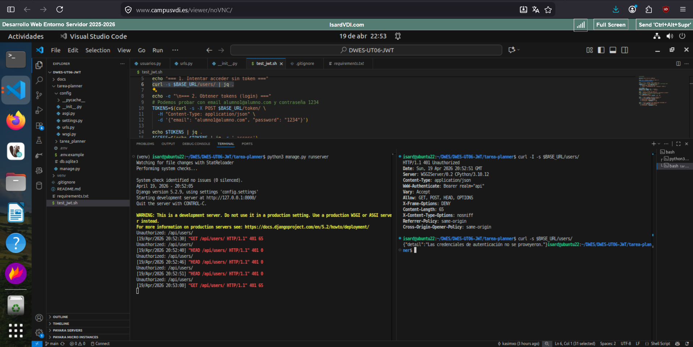
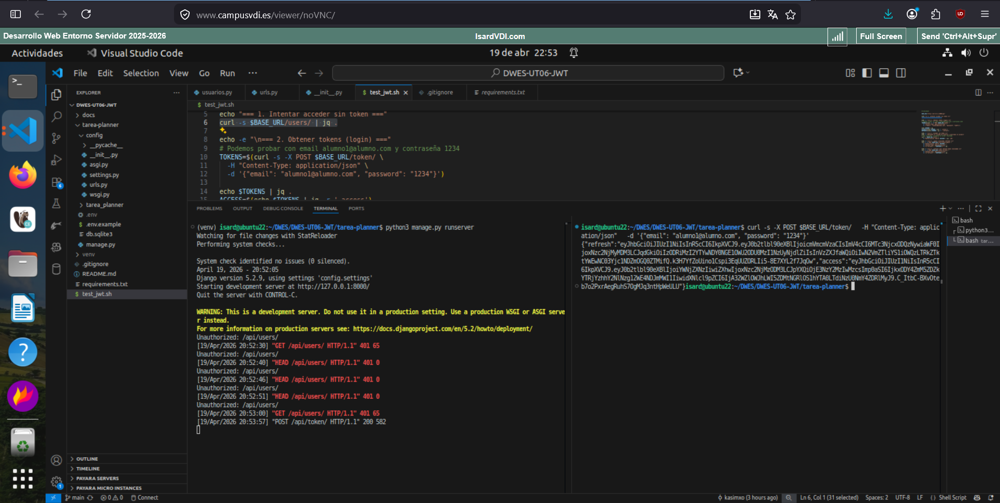
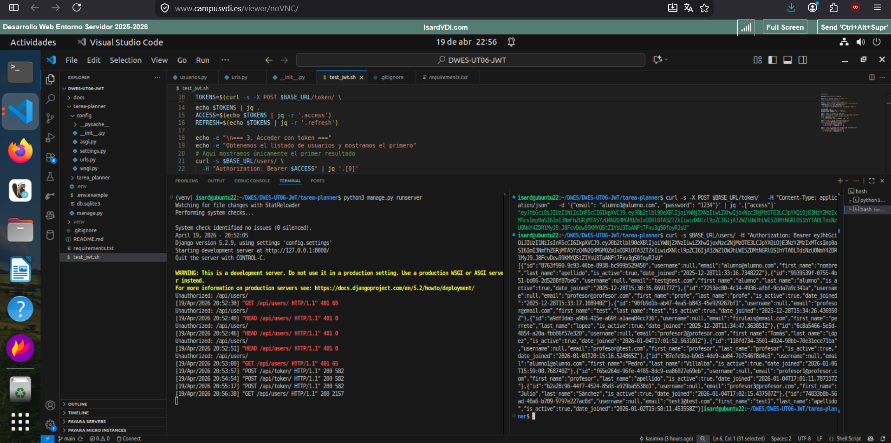
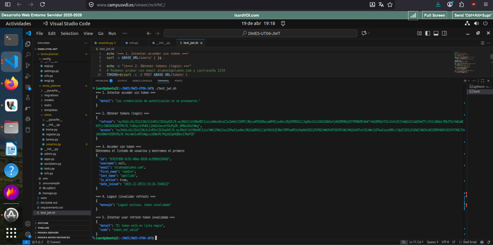

# UT06 Autenticación JWT

## Índice

- [Introducción](#introducción)
- [Modificaciones](#modificaciones)
  - [Parte 1](#parte-1)
  - [Parte 2](#parte-2)
  - [Parte 3](#parte-3)
- [Resultado final](#resultado-final)
- [Explicación de la ejecución del script](#expicación-de-la-ejecución-del-script)

## Introducción

En esta práctica se implementa la autenticación a través de token JWT sobre la aplicación construida en la práctica [UT04 Persistencia de datos](https://github.com/kasimxo/DWES-UT04-Persistencia-de-datos).


## Modificaciones

### Parte 1:

En un primer lugar se han añadido las dependencias correspondientes:

```
pip install djangorestframework djangorestframework-simplejwt
```

Después se ha modificado la configuración del archivo [settings.py](./tarea-planner/config/settings.py) para agregar las nuevas apps, la configuración del rest_framework y la configuración del token jwt:

```
INSTALLED_APPS = [
    ...
    "rest_framework",
    "rest_framework_simplejwt",
    "rest_framework_simplejwt.token_blacklist",
]

REST_FRAMEWORK = {
    'DEFAULT_AUTHENTICATION_CLASSES': [
        'rest_framework_simplejwt.authentication.JWTAuthentication',
    ],
    'DEFAULT_PERMISSION_CLASSES': [
        'rest_framework.permissions.IsAuthenticated',  # Por defecto, todo requiere auth
    ],
}

from datetime import timedelta

SIMPLE_JWT = {
    'ACCESS_TOKEN_LIFETIME': timedelta(minutes=30),
    'REFRESH_TOKEN_LIFETIME': timedelta(days=1),
    'ROTATE_REFRESH_TOKENS': True,
    'BLACKLIST_AFTER_ROTATION': True,
    'AUTH_HEADER_TYPES': ('Bearer',),
}
```

Se han añadido las nuevas rutas al archivo [config/urls.py](./tarea-planner/config/urls.py).


A continuación se han aplicado las migraciones correspondientes.

### Parte 2:

Primero se ha creado el archivo [Serializers.py](./tarea-planner/tarea_planner/serializers.py).

Depués se han modificado las [vistas correspondientes a los usuarios](./tarea-planner/tarea_planner/views/usuarios.py) para utilizar la autenticación por token JWT.

Se han modificado y agregado las nuevas rutas al archivo [tarea_planner/urls.py].

### Parte 3:

Para implementar el logout en primer lugar se ha eliminado la lógica ya existente y después se ha agregado la clase LogoutView en el archivo de [vistas de usuarios](./tarea-planner/tarea_planner/views/usuarios.py).

Por último se ha modificado la ruta de logout en el archivo [tarea_planner/urls.py].

## Resultado parte 1

Al probar el endpoint POST /api/users/ con usuario y contraseña correcto e incorrecto, podemos ver los dos tipos de respuesta que da:



## Resultado parte 2

Primero probamos a hacer el GET de users sin token:



Después conseguimos un token JWT:



Y por último recuperamos el listado de usuarios haciendo la petición con el token obtenido:



## Resultado final

Para evaluar el correcto funcionamiento del sistema de autenticación a través de token JWT se ejecuta el script [test_jwt.sh](test_jwt.sh), sobre el que se han realizado las modificaciones mínimas para que funcione en este proyecto.

El resultado de la ejecución del script es el siguiente:


## Expicación de la ejecución del script

A continuación se añade una explicación de las distintas partes del script test_jwt.sh:

```
#!/bin/bash

BASE_URL="http://127.0.0.1:8000/api"

echo "=== 1. Intentar acceder sin token ==="
curl -s $BASE_URL/users/ | jq .
```
En primer lugar establecemos la variable que se empleará como ruta base para las peticiones de la api.

Después efectuamos una primera llamada para tratar de recuperar el listado de usuarios. En la captura de la ejecución del script podemos ver que como no hemos agregado un token jwt válido la llamada falla.

```
echo -e "\n=== 2. Obtener tokens (login) ==="
# Podemos probar con email alumno1@alumno.com y contraseña 1234
TOKENS=$(curl -s -X POST $BASE_URL/token/ \
  -H "Content-Type: application/json" \
  -d '{"email": "alumno1@alumno.com", "password": "1234"}')

echo $TOKENS | jq .
```
Aquí obtenemos un token válido haciendo una llamada post con el correo electrónico y la contraseña de un usuario registrado.

Vemos el token obtenido en la terminal a través del comando echo $TOKENS.

```
ACCESS=$(echo $TOKENS | jq -r '.access')
REFRESH=$(echo $TOKENS | jq -r '.refresh')
```
Configuramos dos variables más, una para el token de acceso y otra para el token de refresco. Estas variables son útiles para evitar tener que pegar el token completo en cada una de las llamadas que haremos a continuación.

```
echo -e "\n=== 3. Acceder con token ==="
echo -e "Obtenemos el listado de usuarios y mostramos el primero"
# Aquí mostramos únicamente el primer resultado
curl -s $BASE_URL/users/ \
  -H "Authorization: Bearer $ACCESS" | jq '.[0]'
```
Utilizamos el token de acceso que hemos obtenido para recuperar el listado de usuarios a través de una llamada GET a la api sobre un endpoint que esta protegido. A continuación, mostramos el primer usuario a través de la terminal.

```
echo -e "\n=== 4. Logout (invalidar refresh) ==="
curl -s -X POST $BASE_URL/users/auth/logout/ \
  -H "Authorization: Bearer $ACCESS" \
  -H "Content-Type: application/json" \
  -d "{\"refresh\": \"$REFRESH\"}" | jq .
```
Ahora hacemos el logout para el token de refresco, lo que hace que se agregue este token a la blacklist.

```
echo -e "\n=== 5. Intentar usar refresh token invalidado ==="
curl -s -X POST $BASE_URL/token/refresh/ \
  -H "Content-Type: application/json" \
  -d "{\"refresh\": \"$REFRESH\"}" | jq .
```
Al intentar usar un token que está dentro de la blacklist, la api rechaza la petición y muestra un mensaje de error.